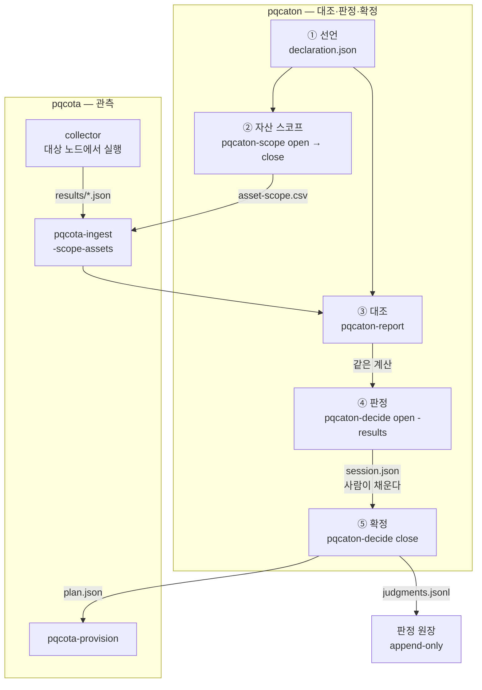

# 설계 — 인벤토리 거버넌스

[개요](../README.md) · [릴리스 노트](../RELEASE_NOTES.md) · [여정](journey.md) · **설계** · [검증 기준](testcases.md) · [데모](../demo/README.md) · [구조 그림](https://www.sntsoft.co.kr/pqcaton/)

pqcota가 **관측**하고, 이 리포가 **그 관측을 판정으로 잇습니다.**

pqcota는 관측한 사실만 냅니다 — 무엇이 위험한지, 무엇을 먼저 바꿀지 판정하지 않습니다.
[그 리포가 명시적으로 뺀 것](https://github.com/randyinthedev-hash/pqcota/blob/main/docs/architecture.md)이
선언(CMDB) 대조·confidence 스코어링·리뷰 큐·확정 거버넌스이고, 이 문서가 그것들을 다룹니다.

> **§ 표기**: 별도 언급이 없으면 pqcota
> [규정서](https://github.com/randyinthedev-hash/pqcota/blob/main/docs/regulation.md)의 절 번호입니다.

---

## 0. 명령이 도는 순서

이 리포의 명령들이 **무엇을 입력으로 받고 무엇을 출력하는지**, 어떤 차례로 도는지입니다.
각 단계의 설계 근거는 아래 §1부터에 있습니다.



### 입력과 출력

| 명령 | 하는 일 | 입력 | 출력 |
|---|---|---|---|
| [`pqcaton-scope open`](../inventory/cmd/pqcaton-scope) | 계층을 겹쳐 **바뀐 규칙만** 승인 대상으로 올립니다 | 계층 CSV 여럿 · `-base` 현재 정책 | 스코프 세션(바뀐 규칙만) |
| `pqcaton-scope close` | 승인을 확인하고 **정책을 배포 형태로** 냅니다 | 사람이 채운 스코프 세션 | **`asset-scope.csv`** · 판정 원장 |
| `pqcaton-scope review` | 빼둔 자산을 **이름으로** 다시 올립니다 | 정책 CSV · 관측 결과 | 다시 볼 제외분(승인 없음·만료) |
| [`pqcaton-report`](../inventory/cmd/pqcaton-report) | 여러 노드의 관측을 선언과 **대조해 보여 줍니다** | 관측 결과 · 선언 | 콘솔 리포트 · 토폴로지 DOT |
| [`pqcaton-decide open`](../inventory/cmd/pqcaton-decide) | 대조 결과에서 **사람이 판정할 것만** 골라 냅니다 | 선언 · **관측 결과**(`-results`) | 리뷰 세션(판정 대상) |
| `pqcaton-decide open` *(지름길)* | **명령이 도는 그 기계 자신**을 스캔해 같은 일을 합니다 | 선언 CSV | 리뷰 세션 |
| `pqcaton-decide close` | **확정 게이트** — 결론과 서명이 다 있어야 계획이 나갑니다 | 사람이 채운 리뷰 세션 | **`plan.json`**(계약 형식) · 판정 원장 |
| `pqcaton-decide delta` | 재관측 뒤 **근거가 바뀐 판정만** 골라 냅니다 | 판정 원장 · 지금 관측 | 근거가 바뀐 판정만 |
| [`pqcaton-ui`](../inventory/cmd/pqcaton-ui) | 위 전부를 **화면에서** 다룹니다 — 선언과 스코프 규칙을 고치고, 대조를 보고, 판정·확정합니다. **세션도 화면이 엽니다** | 선언 · 관측 결과 · 계층 CSV | 같은 파일에 씁니다 — **같은 게이트** |

**사람이 하는 자리는 두 곳뿐입니다** — 스코프 세션과 리뷰 세션을 채우는 것. 나머지는 파일이
다음 명령의 입력이 됩니다. 그 파일들이 곧 감사 기록입니다.

> 위 그림은 **명령으로 도는 길**입니다. 화면(`pqcaton-ui`)은 같은 다섯 걸음을 같은 파일과
> 같은 게이트로 돕니다 — 재료만 주면 세션까지 화면이 엽니다(아래 「세션은 재료에서
> 나옵니다」). **명령의 출력은 영어이고, 화면은 한국어와 English 중에 고릅니다**
> ([CONTRIBUTING 「어느 말로 쓰나」](../CONTRIBUTING.md#어느-말로-쓰나)).

### 「무엇을 볼 것인가」가 두 층입니다

말이 겹치기 쉬운 자리라 적어 둡니다. 둘 다 관측 범위를 정하지만 **층이 다릅니다.**

| | 무엇을 정하나 | 어디에 | 화면에서 |
|---|---|---|---|
| **관리 대상 노드** | **어느 노드**를 볼 것인가 | 선언의 `scope` — 노드 이름 목록 | ① 선언 탭 안 |
| **자산 스코프** | 그 노드 **안에서 무엇**을 계속 볼 것인가 | 정책 CSV — glob 규칙 | ② 자산 스코프 탭 |

노드를 등재해도 그 안에서 관측되는 것이 전부 관리 대상은 아닙니다 — 시스템 기본 라이브러리나
패키지 매니저가 딸려 넣은 런타임이 섞이면 인벤토리가 잡음에 묻힙니다(§1.6). 그래서 층이 둘입니다.

> 코드와 이 문서는 pqcota 의 `scope.AssetPolicy` 를 따라 **「자산 스코프」** 라고 씁니다.
> 화면도 같은 말을 쓰되, 선언 안의 노드 목록은 **「관리 대상 노드」** 로 불러 겹치지 않게 합니다.

### 사람이 하는 일 — 판정 · 승인 · 확정

셋이 다른 일입니다. 화면과 명령이 같은 말을 씁니다.

| | 무엇 | 없으면 |
|---|---|---|
| **판정** | 대상 하나(또는 정책·계층 하나)에 **결론**을 다는 것 | 필수 항목이 남아 확정되지 않습니다 |
| **승인** | **승인자와 서명**을 채우는 것 — 누가 책임지는가 | 서명이 없어 확정되지 않습니다 |
| **확정** | 게이트를 지나 **산출물이 나가는 것**(계획·정책) | 판정과 승인이 다 있어도 이 단계를 밟아야 나갑니다 |

### 세션은 재료에서 나옵니다 — 명령으로도, 화면으로도

리뷰 세션과 스코프 세션은 **재료에서 파생된 것**입니다. 재료가 있으면 명령도 화면도 그것을
세울 수 있습니다 — 재료를 손에 들고도 명령을 한 번 돌려야 화면이 열리는 것은, 화면을 두는
이유와 어긋납니다(v0.12.0).

| 화면 탭 | 무엇에서 나오나 | 화면에 무엇을 주면 되나 |
|---|---|---|
| ① 선언 | 사람이 처음 씁니다(데모는 `declare.py`) | `-decl declaration.json` |
| ② 자산 스코프 | **계층 CSV** 를 `-base` 와 견줘 **바뀐 규칙만** | `-layers corp.csv,prod.csv -base asset-scope.csv` |
| ③ 대조 | 만들 것이 없습니다 — 결과 디렉터리를 읽습니다 | `-results <디렉터리>` |
| ④ 리뷰 큐 | **선언 + 관측 결과** | `-decl` 과 `-results` |

**세션 파일은 사람이 적은 것을 담습니다** — 판정·승인·서명. 재료가 바뀌면 세션은 다시
세워지고, 적어 둔 판정은 동일성(규칙은 `RuleID`, 항목은 `ID`)을 열쇠로 따라옵니다.

> **다만 못 본 것은 승인으로 덮이지 않습니다.** 계층이나 정책에 **못 보던 변경이 생기면 그
> 일괄 결론을 지웁니다.** 일괄 판정은 「본 것들을 보고 내린 결론」인데 새 변경은 사람이 본
> 적이 없습니다 — 그대로 두면 방금 나타난 shadow 나 방금 넣은 `exclude` 가 **누가 승인한 적
> 없는 근거를 달고** 확정을 통과합니다. 정책·큐가 달라지면 **서명도 지웁니다**(승인자 이름은
> 남깁니다 — 그건 사람이지 확인이 아닙니다).

명령으로 세우는 길(`pqcaton-scope open` · `pqcaton-decide open`)은 그대로입니다. 세우는
코드가 공용 패키지 한 곳이라(`review.FromResults` · `scope.NewSession`), 명령과 화면이 같은
큐를 봅니다 — 두 벌이면 화면에서 본 shadow 와 판정할 것이 갈립니다.

확정되면 남는 것은 산출물(`asset-scope.csv`·`plan.json`)과 판정 원장입니다.

### 자산 스코프 규칙은 화면에서 고칩니다

계층 CSV의 다섯 칸(`action,runtime,lib,app_key,note`)은 **pqcota의 형식 그대로**입니다.
그것을 손으로 적으라고 하려면 칸의 뜻과 glob과 계층 우선순위를 문서로 가르쳐야 하고, 그
문서가 편집 화면보다 비쌉니다 — **그래서 설명을 표 위에 두고 표를 편집 가능하게 했습니다.**

- **합본이 아니라 계층 파일을 고칩니다.** 합본에 쓰면 그 규칙이 조직에서 왔는지 노드군에서
  왔는지가 사라지고, 다음 리뷰에서 누구에게 물어야 할지 알 수 없게 됩니다.
- **`action` 은 고르는 칸입니다.** 오타로 규칙이 죽지 않게 합니다.
- **세 칸이 모두 빈 줄은 규칙으로 만들지 않습니다.** pqcota는 빈 칸을 `*`로 읽으므로 그대로
  만들면 `exclude,*,*,*` — **인벤토리가 통째로 빕니다.** 「전부」를 뜻하려면 `*`를 적습니다.

계층 **구성**(어느 파일이 어느 순서로 겹치나)은 조직 구조라 명령줄에서 정합니다 — `-layers`
의 순서가 곧 상속 순서입니다.

### 두 갈래 — 주경로와 지름길

| | 관측을 어디서 | 언제 쓰나 |
|---|---|---|
| **주경로** | pqcota 가 여러 노드에서 모은 `results/` | 실제 운영. `pqcaton-decide open -results` |
| **지름길** | **명령이 도는 그 기계 자신**(`/proc`) | 체험. `pqcaton-decide open decl.csv` |

**지름길은 대상을 고르지 못합니다.** 원격 접속도 노드 선택도 없이 자기가 도는 기계의 `/proc`
하나만 읽습니다 — 다른 노드를 관측하려면 pqcota 의 collector 를 그 노드에서 돌려야 합니다.
그래서 두 가지가 따라옵니다.

- **Linux 에서만** 됩니다. `/proc` 이 없으면 명령이 끊습니다.
- 노드 이름은 결과에 붙이는 **이름표일 뿐**입니다. `pqcaton-decide open decl.csv web-gw` 는
  `web-gw` 를 관측하지 않고 **이 기계를 관측해 `web-gw` 라고 적습니다** — 이름이 맞으면 선언과 대조까지
  되어 **다른 기계의 관측으로 CONFIRMED 가 나옵니다.** 그래서 다른 이름을 주면 경고합니다.

### 되풀이되는 것

한 번 돌고 끝나지 않습니다. 재관측한 뒤와 시간이 지난 뒤에 각각 돌아옵니다.

| 언제 | 무엇 | 왜 |
|---|---|---|
| 재관측한 뒤 | `pqcaton-decide delta` | **근거가 바뀐 판정만** 다시 봅니다. 전부 다시 보게 하면 아무도 안 봅니다 |
| 주기적으로 | `pqcaton-scope review` | **제외는 영구 면제가 아닙니다.** 빼둔 사이 위험해진 것을 다시 올립니다 |

---

## 1. 인벤토리 엔진 — 대조·판정·거버넌스

pqcota는 관측을 모아 **읽기전용 뷰**와 `plan`·`decision` 스키마까지 냅니다.
그 위에서 무엇을 확정할지 정하는 엔진이 여기 있습니다.

### 1.1 대조 엔진 — 3-상태 reconciliation (규정서 §3.3①)
각 통신 엣지를 선언∩관측으로 분류합니다. 결정론 부분은 AUTO, 모호 부분은 MANUAL로
강등합니다.

| 상태 | 정의 | 등급 | 의미 |
|---|---|---|---|
| **CONFIRMED** | 선언 ∩ 관측 | AUTO | 신뢰도 최상 |
| **UNDECLARED** | 관측 only | AUTO | **shadow 통신** — 보안 최우선 발견 |
| **UNOBSERVED** | 선언 only | **MANUAL** | 실존(DR/배치) vs stale vs 커버리지 갭 — 기계 확정 불가 |

- UNOBSERVED의 핵심: pqcota의 **완전성 맵**(관측하지 못함 ≠ 없음)이 결정적입니다 — "관측 안 됨"이 "실제 없음"인지 "원리상 못 봄(갭)"인지 갈립니다. 갭이면 재수집, 아니면 사람 판정입니다.
- 입력: 관측 엣지(network-collector TLS 등급 + CBOM), 선언 엣지(declaration-importer). evidence_strength가 confidence로 전파됩니다.

**대조는 조직에 묶입니다.** 엔진은 조직 하나로 열리고(`reconcile.For`), 다른 조직의 자산이나
엣지가 입력에 하나라도 섞이면 **대조하지 않고 끊습니다.** pqcota 스냅샷에도 계약의 `Envelope`에도
조직 필드가 없어 엔진이 스스로 알아낼 길이 없으므로, 조직은 부르는 쪽이 단언하고 그 단언이
어긋나는 순간을 엔진이 잡습니다.

섞인 입력을 그냥 두면 **오류가 아니라 그럴듯한 결과**가 나오는 것이 이 검사가 필요한 이유입니다 —
조직이 동일성의 일부라 열쇠가 맞지 않고, 같은 자산이 UNDECLARED와 UNOBSERVED 한 쌍으로 갈려
리뷰 큐가 그것을 shadow 발견으로 올립니다. 판정 원장의 대상 id에는 조직을 넣지 않습니다 —
원장이 이미 조직별로 갈려 있어 중복이고, 넣으면 이전에 쌓인 판정의 대상이 전부 어긋납니다.

### 1.2 confidence 스코어링 (§3.5)
```
confidence = f(관측빈도, 관측기간, 선언신선도, 소스일치도, evidence_strength)
```
AUTO·결정론(파생 뷰)입니다. 리뷰 큐 우선순위·자동통과 후보 선별의 입력이 됩니다.
`evidence_strength`(confirmed/inferred-*)가 1급 가중치이며 — inferred-low는 confidence 상한을
누릅니다.

### 1.3 리뷰 큐 (§3.3②) — PROPOSE
대조 엔진은 정답이 아니라 판정 대상을 구조화합니다.
- **자동통과 후보**: CONFIRMED + 고신뢰 + 저위험 → 일괄 승인 묶음(승인은 사람이 합니다).
- **필수 개별 리뷰**: UNDECLARED, 저신뢰 UNOBSERVED, 레거시 터치 필요, 컷오버가 상대방을 깨는 엣지.
- **우선순위 = 위험도 × 블라스트반경 × 데이터민감도.**

### 1.4 리뷰-확정 상태기계 (§3.3③) — MANUAL
```
draft ──▶ in-review ──▶ finalized
                         └ 전 필수항목 판정 + 승인 서명 (전제)
```
- **finalized 전에는 프로비저닝을 실행할 수 없습니다**(§3.7 최강 게이트). 링/도메인 단위 부분 확정은 허용합니다.
- **리뷰 granularity(§3.4, 하이브리드)**: 정책 단위가 기본입니다(버전×링크모드·JDK×provider 카탈로그가 리뷰 대상 정책 템플릿 → 동종 자산 일괄). 개별 격리는 예외이며, 정책 예외·고위험·shadow 엣지만 엣지 단위로 봅니다.

### 1.5 판정 영속화 (§3.6)
- 판정은 엣지 상태가 아니라 "인간의 결론"이라 재수집에도 부착을 유지합니다(`Decision.BasisHash`로 근거를 추적합니다).
- **무효화 트리거**: 근거 증거가 실질적으로 바뀌면 해당 판정만 재검토 플래그를 답니다 → **델타 리뷰**(전면 재리뷰가 아닙니다).
- stale 판정 만료: 신뢰도 감쇠·주기 재확인. 이 판정 이력이 provenance chain의 **판단 계열**입니다(§0.3).

> 스키마(`Decision`·`FinalizedPlan`·`ReconState`)는 [pqcota의 계약](https://github.com/randyinthedev-hash/pqcota/tree/main/contracts)이 SSOT입니다.
> 이 리포는 그 어휘로 말하고, 위 엔진만 여기서 만듭니다.

---

### 1.6 자산 스코프 거버넌스 (2026-07-21)

pqcota가 **메커니즘**을 갖습니다: `scope.AssetPolicy`(CSV 규칙, glob) — 노드를 등재해도 그 안에서
**무엇을 계속 관리할지**를 사용자가 선언하고, `pqcota-ingest -scope-assets`가 적재 전에 집행합니다.
제외분은 `Snapshot.ExcludedByScope`로 세어 고지됩니다(제외 ≠ 부재, §2.7). 잡음을 못 거르면 인벤토리 자체가 못 쓰게 되므로,
이것은 관측 도구가 스스로 갖춰야 합니다 — pqcota 없이 이 리포만으로는 아무것도 못 한다는 뜻이 아니라,
그 반대입니다: **pqcota는 혼자서도 끝까지 됩니다.**

이 리포가 더하는 것은 그 위의 **거버넌스와 규모**입니다:

| 축 | 이 리포가 더하는 것 | 왜 조직에서만 필요한가 |
|---|---|---|
| **리뷰-확정** | 스코프 변경(특히 exclude 추가)을 [§1.4 리뷰-확정 상태기계](#14-리뷰-확정-상태기계-33--manual)에 태워 제안→검토→승인 | "이 자산은 안 본다"는 결정은 **감사 대상**입니다. 혼자면 자기 책임이지만 조직은 근거·승인자를 남겨야 합니다 |
| **감사 추적** | 누가·언제·왜 제외했고 그때 무엇이 빠졌는지 [§1.5 판정 영속화](#15-판정-영속화-36)에 기록 | 사고 후 "왜 이게 인벤토리에 없었나"에 답해야 합니다 |
| **정책 상속·일괄** | 조직→환경(prod/dev)→노드군 계층 정책, 수천 대 일괄 적용·드리프트 검출 | CSV 한 장은 20대까진 되지만 5000대에선 관리가 안 됩니다 |
| **제외분 재검토** | 제외된 자산을 주기적으로 다시 훑어 "빼둔 사이 위험해진 것"을 리뷰 큐로 | 제외는 영구 면제가 아닙니다. 이 판정이 곧 §1.1 대조의 확장입니다 |

**경계 요약**: 규칙의 **정의·집행은 pqcota**, 규칙 변경의 **승인·감사·규모 운영은 여기**입니다.
이 리포는 pqcota의 `AssetPolicy`를 재구현하지 않고 **생성·배포**합니다 — 거버넌스가 확정한
정책을 CSV·계약으로 내려보내면 pqcota의 집행기가 그대로 씁니다.

**구현 상태**: [`pkg/inventory/scope`](../pkg/inventory/scope)와
[`pqcaton-scope`](../inventory/cmd/pqcaton-scope)에 있습니다.

상속은 **규칙 이어붙이기**입니다. pqcota가 이미 "매치되는 마지막 규칙이 결정"이라 정해 두었으므로
상위를 앞, 하위를 뒤에 두면 그대로 하위 우선이 됩니다 — **판정 규칙이 세상에 하나만 존재합니다.**
우리가 잠금을 따로 두면 내려보낸 CSV를 pqcota가 집행한 결과와 우리 화면이 갈라집니다. 하위가 상위
제외를 `include`로 되돌릴 수 있다는 뜻이기도 한데, 그것을 막는 자리는 상속 규칙이 아니라
**리뷰-확정 게이트**입니다 — 하위 정책 변경도 승인을 거칩니다.

**`exclude` 추가만 근거 필수입니다.** 제외를 거두는 쪽은 인벤토리가 넓어지는 방향이라 무게가
다릅니다. 그리고 pqcota는 제외분을 **수로** 셉니다(`ExcludedByScope`) — 잡음을 거르는 데는 그것으로
충분하지만, 사고 뒤에 "왜 이게 인벤토리에 없었나"에 답하려면 **이름**이 있어야 합니다. 그래서
`review`가 pqcota의 `Managed`를 그대로 호출해 무엇이 빠졌는지 이름으로 냅니다.

---

## 2. 조직 격리

인벤토리는 **한 조직의 암호 자산 지도**입니다. 다른 조직의 것이 섞이면 그 자체로 사고입니다 —
계열사 분리든 여러 고객을 함께 다루든, 경계는 **데이터에 박혀 있어야 하지 질의를 쓰는
사람의 기억에 있으면 안 됩니다.**

### 2.1 격리를 끌 수 없게 만듭니다

**조직 타입은 pqcota 의 `pkg/org` 를 그대로 씁니다.** 규칙은 그대로입니다 — **빈 조직으로는
저장소를 열 수 없습니다.**

전에는 이 리포가 같은 이름의 패키지를 따로 갖고 있었는데, pqcota v0.2.0이 인벤토리에 조직
축을 넣으면서 **같은 이름의 다른 타입이 둘**이 되었습니다. 컨트롤 플레인은 두 저장소를 다
쥐므로(판정은 여기, 인벤토리는 pqcota) 경계마다 변환이 생기고 검증 규칙이 어느 쪽인지
헷갈리는 자리가 남습니다. pqcota 것이 상위집합이라 그쪽으로 모았습니다.

**다만 `Resolve`는 쓰지 않습니다.** pqcota의 `Resolve`는 빈 값을 기본 조직으로 품는데,
이 리포에서 조직이 비어 있는 것은 품을 상황이 아니라 버그입니다. `Parse`만 씁니다.

타입이 같아지면서 저장소가 pqcota의 `org.Scoped`를 그대로 만족합니다 — 컨트롤 플레인이
기동할 때 **핸들에 직접 조직을 물어** 확인할 수 있습니다. 환경변수는 프로세스마다 달라지므로
실제 핸들에 묻는 편이 안전합니다. 그 성질은 테스트가 컴파일 시점에 지킵니다.

저장소 핸들이 조직에 묶입니다. `NewPgJudgmentStore(ctx, dsn, org)`가 돌려주는 핸들의 모든
질의에 `WHERE org = $1`이 이미 붙어 있고, **그것을 빼는 방법이 없습니다.** 질의마다 조건을
기억할 일이 없으니 잊을 일도 없습니다.

| | |
|---|---|
| 인덱스 | `(org, subject, seq)` — 선두가 org라 모든 조회가 조직으로 먼저 걸립니다 |
| 인메모리 저장소 | Pg판과 **같은 규칙**입니다. 테스트가 격리 없는 경로를 타면 실제와 어긋납니다 |
| 식별자 모양 | 소문자·숫자·하이픈. 대소문자를 섞으면 `Acme`와 `acme`가 다른 조직이 되어 데이터가 조용히 갈립니다 |

### 2.2 행 수준 보안 — DB가 막는 한 겹

질의마다 `org`를 다는 것은 **우리가 안 틀린다는 전제** 위에 서 있습니다. 여러 조직이 한
데이터베이스를 쓰는 배포에서는 그 전제 하나에 전부를 걸 수 없습니다 — 조건을 빠뜨린 질의가
언젠가 들어옵니다. 그래서 판정 원장에 Postgres RLS를 겁니다.

```sql
ALTER TABLE pqcota_judgments ENABLE ROW LEVEL SECURITY;
ALTER TABLE pqcota_judgments FORCE ROW LEVEL SECURITY;
CREATE POLICY pqcaton_org_isolation ON pqcota_judgments
    USING      (org = current_setting('pqcaton.org', true))
    WITH CHECK (org = current_setting('pqcaton.org', true));
```

조직은 **연결마다 세션 변수로** 심습니다. 핸들 하나가 조직 하나이므로 세션 단위로 충분하고,
질의마다 기억할 것이 없습니다.

함정이 셋 있어 적어 둡니다.

| 함정 | 어떻게 다뤘는가 |
|---|---|
| **`FORCE`가 없으면 테이블 소유자는 예외** | 대개 앱이 소유자로 붙으므로, 그 한 줄이 없으면 정책을 걸어 놓고도 아무 일도 일어나지 않습니다 |
| **슈퍼유저·`BYPASSRLS` 롤은 정책을 통째로 건너뜀** | 열 때 한 번 재서 `RLSActive()`로 들고 다닙니다. `PQCATON_REQUIRE_RLS=1`이면 **열지 않습니다** — pqcota의 `PQCOTA_REQUIRE_SIGNATURE`와 같은 모양입니다 |
| **`WITH CHECK`가 없으면 읽기만 막힘** | 남의 조직 이름으로 쓴 행이 들어가고, 그 행은 정작 우리 눈에는 안 보입니다 — 가장 고약한 형태라 쓰기도 함께 막습니다 |

**앱은 테이블 소유자로 붙지 않는 것이 전제입니다.** 그러면 그 연결에 DDL 권한이 없는 것이
정상이므로, 저장소는 스키마가 이미 갖춰져 있으면 넘어가고 아니면 **무엇을 소유자로 돌려야
하는지 말하고 멈춥니다.** 배포에서는 아래를 소유자 권한으로 한 번 돌립니다.

```sql
CREATE ROLE pqcaton_app LOGIN PASSWORD '...' NOSUPERUSER NOBYPASSRLS;
GRANT USAGE ON SCHEMA public TO pqcaton_app;
GRANT SELECT, INSERT ON pqcota_judgments TO pqcaton_app;
GRANT USAGE, SELECT ON ALL SEQUENCES IN SCHEMA public TO pqcaton_app;
```

### 2.3 무엇을 아직 하지 않았나

- **인증·권한** — 누가 어느 조직에 속하는지는 이 계층이 정하지 않습니다. 호출자가 이미
  확인한 조직을 받습니다.
- **인가(누가 무엇을 승인할 수 있나)** — 조직 안에서 누가 무엇을 확정할 자격이 있는지는
  이 계층이 정하지 않습니다. 서명은 받아 남기지만 그 사람이 그럴 자격인지는 묻지 않습니다.
