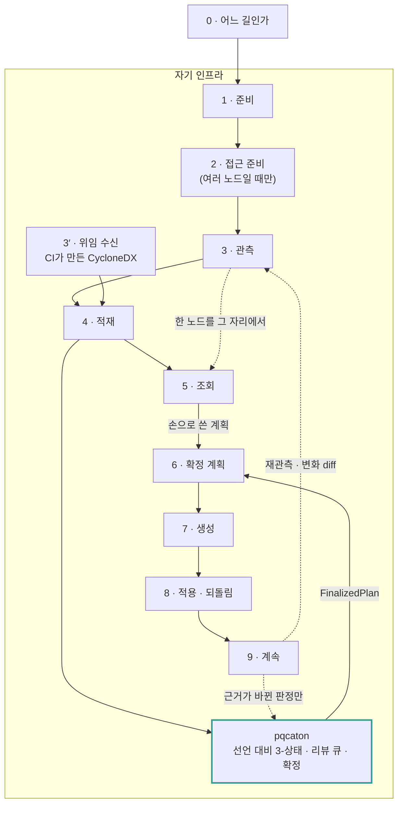
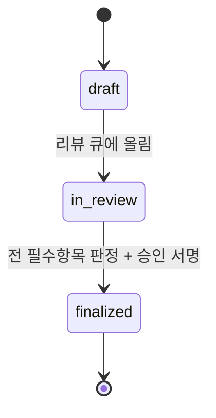

# 여정

[개요](../README.md) · [릴리스 노트](../RELEASE_NOTES.md) · **여정** · [설계](design.md) · [검증 기준](testcases.md) · [데모](../demo/README.md) · [구조 그림](https://www.sntsoft.co.kr/pqcaton/)

이 문서는 관측부터 확정까지를 **처음부터 끝까지** 따라갑니다.

**이 문서는 직접 설치를 따라갑니다.** 관측도 대조도 판정도 전부 고객 인프라 안에서
끝납니다. 밖으로 보낼 것도, 밖에서 받을 것도 없습니다.

> **호스팅으로 쓰면 다릅니다.** 관측 결과가 고객망을 나와 컨트롤 플레인으로 올라가고, 그
> 올리는 자리가 [`saas/runner`](../saas/runner/README.md)입니다. 무엇을 보내고 무엇을 보내지
> 않는지가 그 문서에 표로 있습니다.

> **§ 표기**: 별도 언급이 없으면 pqcota
> [규정서](https://github.com/randyinthedev-hash/pqcota/blob/main/docs/regulation.md)의 절 번호입니다.
> 구조 그림은 [site/index.html](../site/index.html)에 있습니다.

---

## 한눈에

**pqcota의 여정 그대로입니다.** 그림의 번호와 상자는 그쪽
[여정](https://github.com/randyinthedev-hash/pqcota/blob/main/docs/journey.md)의 것이라
**아래 이 문서의 절 번호와 다릅니다.** 이 리포가 더하는 것은 **굵은 상자 하나**입니다.



**6번이 이 리포가 들어오는 자리입니다.** pqcota는 확정 계획을 **입력으로만** 받습니다.
*무엇을 언제 바꿀지는 그 도구가 정하지 않고*, 손으로 쓴 계획으로도 끝까지 됩니다.
굵은 상자가 그 자리를 채웁니다.

| | |
|---|---|
| **`4 → pqcaton`** | 이 리포는 pqcota가 쌓은 것을 **읽기만** 합니다. 관측을 다시 하지 않습니다 |
| **`손으로 쓴 계획`** | pqcaton이 없어도 파이프라인은 끊기지 않습니다. **없으면 사람이 매번 씁니다** |
| **`9 ⇢ pqcaton`** | 재관측은 3번으로, **근거가 바뀐 판정만** 리뷰 큐로 갑니다. 돌아오는 길이 둘로 나뉩니다 |

굵은 상자 안은 이 문서의 [2](#2-선언-조직이-이렇게-알고-있다고-적은-것)·[4](#4-대조-3-상태)·[5](#5-리뷰--확정)절입니다.

---

## 0. 시작하기 전에

**전부 고객 인프라 안에서 돕니다.** 관측 결과는 고객이 모아 둔 자리에 그대로 있고, 대조와
판정·확정은 그 옆에서 파일로 남습니다. 명령과 화면이 그 파일들을 읽고 씁니다. 밖으로
올리는 자리가 없습니다.

**프로덕션 5노드까지 기간 제한 없이 무료입니다.** [BUSL-1.1](../LICENSE)의 Additional Use
Grant이고, 평가·개발·테스트는 규모 제한도 없습니다([라이선스 안내](../LICENSING.md)).

### 보안팀이 먼저 묻는 것

| 질문 | 답 |
|---|---|
| 무엇이 대상 노드에 남나 | **아무것도 남지 않습니다.** collector를 밀어 넣고 실행하고 결과를 가져온 뒤 지웁니다. 에이전트도 데몬도 없습니다 |
| 접속 정보는 어디에 | 인벤토리에 담을 자리가 **타입에 아예 없습니다**(`MachineEndpoint`). 실행에만 쓰고 영속하지 않습니다 |
| 파일 원문·패킷 페이로드는 | 보내지 않습니다. 핸드셰이크의 협상 그룹만 봅니다. 복호화하지 않습니다 |
| 관측하지 못한 것은 | **못 봤다고 적습니다.** 완전성 맵이 그 자리입니다. 아무 표시 없이 빠지면 *"그 노드엔 없다"*로 읽힙니다 |

---

## 1. 준비: pqcota 1

필요한 것은 셋입니다.

| | |
|---|---|
| **pqcota** | 관측 도구. [pqcota 리포](https://github.com/randyinthedev-hash/pqcota)를 체크아웃합니다. 이 리포는 그 계약만 소비합니다 |
| **Go** | 두 리포를 빌드합니다. `make`가 라이선스 · 문구 · 서식 관문 → 빌드 → 테스트를 차례로 실행합니다 |
| **Ansible** | collector 반입·실행·회수를 pqcota의 참조 플레이북이 합니다. **자체 원격 실행 엔진을 두지 않습니다** |

> **이 리포만으로는 아무것도 못 합니다.** 관측이 없으면 대조할 것이 없기 때문입니다.
> 반대는 성립합니다. **pqcota만으로도 전 과정을 끝낼 수 있습니다.**

---

## 2. 선언: 조직이 「이렇게 알고 있다」고 적은 것

**대조는 맞댈 것이 둘이어야 합니다.** 한쪽은 관측이고 도구가 만듭니다. 다른 한쪽이
선언이고, 그것은 조직이 적습니다. CMDB에서 뽑아도 되고, 없으면 손으로 적어도 됩니다.

맞대면 두 가지가 드러납니다. **선언에 없는데 관측된 것**(`UNDECLARED`)과 **선언에 있는데
관측되지 않은 것**(`UNOBSERVED`)입니다. 그 둘을 사람이 판정하는 것이 이
리포가 하는 일입니다. 세 상태는 [4절](#4-대조-3-상태)에 있습니다.

선언은 파일 하나입니다.

```
declaration.json     scope · nodes · assets · edges
```

| | 무엇을 적나 |
|---|---|
| **`scope`** | 어느 노드를 볼 것인가. 여기 없는 노드는 관측돼도 적재되지 않습니다(§1.4) |
| **`nodes`** | 노드↔IP. 관측에 찍힌 IP를 이 이름과 잇는 근거입니다(§0.4) |
| **`assets`** | 그 노드에서 쓴다고 아는 암호 런타임·컴포넌트 |
| **`edges`** | 그 노드가 어디와 어떻게 통신한다고 아는가 |

**선언이 비어 있어도 됩니다.** 그러면 전부 `UNDECLARED` 로 나옵니다. 「우리가 아는 것이 하나도
없었다」가 첫 리포트입니다.

---

## 3. 관측 · 적재: pqcota 2·3·3′·4·5

pqcota의 참조 플레이북이 대상 노드에 collector를 반입·실행·회수합니다.

```bash
ansible-playbook -i inventory.ini discovery/ansible/discover.yml
```

| collector | 무엇을 보나 |
|---|---|
| **openssl** | 어떤 암호 라이브러리·알고리즘이 실제로 쓰이는가 |
| **jvm** | JCA provider 구성 |
| **cng** | Windows CNG 에 등록된 provider 와 알고리즘 (상류 v0.6.0) |
| **network** | 핸드셰이크에서 **협상된 키교환 그룹**입니다. 여기서 양자내성 등급이 나옵니다 |

산출은 `results/*.json`(`CollectionResult`)입니다. **관측하지 못한 것도 함께 나옵니다.**
완전성 맵이 「원리상 못 봄」과 「실제 없음」을 구분해 둡니다.

### 그림의 나머지 상자들

「한눈에」 그림의 상자는 굵은 것 하나만 빼고 전부 pqcota 여정의 것입니다. **이 문서는 그것을 다시
설명하지 않습니다.** 어디로 가서 읽을지만 적어 둡니다.

| 상자 | 무엇 | 어디에 |
|---|---|---|
| **접근 준비**(pqcota 2) | 접속 정보 CSV 하나에서 Ansible 인벤토리와 노드 표가 나옵니다. **여러 노드를 훑을 때만** 필요합니다 | pqcota 여정 §2 |
| **위임 수신**(pqcota 3′) | CI가 만든 CycloneDX를 관측 대신 받습니다. 빌드 시점의 자산은 런타임에서 안 보이는 것이 있습니다 | pqcota 여정 §3′ |
| **적재**(pqcota 4) | `pqcota-ingest`가 결과를 히스토리에 쌓습니다. **이 리포가 읽는 것이 이 저장소입니다** | pqcota 여정 §4 |
| **조회**(pqcota 5) | `pqcota-inventory`가 최신·이력·diff를 보여 줍니다. 사람이 눈으로 보는 자리이고 **대조와는 다른 일**입니다 | pqcota 여정 §5 |

**한 노드만 보려면 접근 준비와 적재를 건너뜁니다**(그림의 `관측 → 조회` 점선). 그때는 이 리포도
필요 없습니다. 대조할 선언이 없고, 화면 출력에서 끝납니다.

---

## 4. 대조: 3-상태

관측과 선언을 맞대는 자리가 **이 리포**입니다.

```bash
pqcaton-report <results-dir> <declaration.json> [topology.dot]
```

| 상태 | 정의 | 등급 | 뜻 |
|---|---|---|---|
| **CONFIRMED** | 선언 ∩ 관측 | AUTO | 신뢰도 최상 |
| **UNDECLARED** | 관측만 | AUTO | **조직이 모르는 통신**입니다. 이 도구가 주는 첫 번째 쓸모입니다 |
| **UNOBSERVED** | 선언만 | **MANUAL** | 실재하는데 못 본 것인지, 이미 없어진 것인지 사람만 압니다. **기계가 확정하지 않습니다** |

신뢰도(`confidence`)는 관측 빈도·기간·선언 신선도·소스 일치도·`evidence_strength`로
정해집니다(§3.5). `inferred-low`는 상한을 낮춥니다. **약한 근거가 높은 신뢰도로 올라가지
못하게** 막는 자리입니다.

산출은 둘입니다: **3-상태 뷰**와 **거버넌스 토폴로지**(DOT). 토폴로지는 색으로 양자내성
등급을, 선으로 대조 상태를 나타냅니다. 정직성 규정을 그래프 문법으로 강제합니다(§12.2).

---

## 5. 리뷰 · 확정

**대조 엔진은 정답을 주지 않습니다.** 판정 대상을 구조화해 사람에게 넘깁니다(§3.1).

```bash
pqcaton-decide open declaration.json -results results/ -org acme > session.json
#  … 사람이 정책별 결론 · 승인자 · 서명을 채운다
pqcaton-decide close session.json -judgments j.jsonl -org acme > plan.json
pqcaton-decide delta j.jsonl declaration.json -results results/ -org acme   # 근거가 바뀐 것만
```

**파일 왕복인 것이 요점입니다.** 대화형으로 물으면 무엇을 근거로 무엇을 정했는지가 화면에서
사라집니다. 편집한 파일이 그대로 감사 기록입니다.

| 리뷰 큐 | |
|---|---|
| **자동통과 후보** | CONFIRMED + 고신뢰 + 저위험 → 일괄 승인 묶음. **승인은 사람이 합니다** |
| **필수 개별 리뷰** | UNDECLARED(최우선) · 신뢰도 낮은 UNOBSERVED · 레거시를 건드려야 하는 것 · 바꾸면 상대가 깨지는 엣지 |
| 우선순위 | 위험도 × 영향 범위 × 데이터민감도 |



**리뷰 단위는 정책이 기본입니다**(§3.4). 버전×링크모드, JDK×provider 같은 정책 템플릿이 리뷰
대상이고 동종 자산은 일괄로 갑니다. 개별 격리는 예외로 둡니다. 정책 예외·고위험·UNDECLARED 엣지만
엣지 단위로 봅니다. **수천 대를 한 건씩 보는 리뷰는 끝나지 않습니다.**

판정은 **엣지 상태가 아니라 사람의 결론**이라, 재수집으로 관측이 바뀌어도 대상에 붙어 남습니다.
`BasisHash`가 근거를 추적하고, **근거가 실질적으로 바뀌면 그 판정만** 재검토 플래그를 답니다.
`delta`가 그것을 골라 줍니다. 관측이 그대로면 몇 번을 돌려도 다시 볼 것이 없다고 알려 줍니다.

---

## 6. 생성 · 적용 · 되돌림: pqcota 6·7·8

여기서부터 다시 pqcota입니다(그쪽 여정 6·7·8). 이 리포가 넘기는 것은 **`FinalizedPlan` 하나**입니다.

```
5 · 확정 ──▶ FinalizedPlan ──▶ pqcota-provision ──▶ ansible-playbook
```

**finalized 전에는 적용이 돌지 않습니다.** 이것이 이 제품에서 반드시 거쳐야 하는 관문입니다(§3.7).
링·도메인 단위 부분 확정은 허용합니다. 전부 확정될 때까지 아무것도 못 하면 큰 조직에서
영영 시작하지 못합니다.

적용 전 상태 캡처와 실행 기록은 pqcota가 남깁니다(`pqcota_provisioning_record`). 되돌릴 근거가
거기 있습니다.

> **적용은 두 번 돌리면 안 되는 유일한 단계입니다.** 관측과 대조는 몇 번을 돌려도 대상이
> 바뀌지 않지만, 적용은 대상을 바꿉니다. 두 번째 `before` 캡처는 **이미 바뀐 상태**를 찍어 되돌릴
> 근거가 망가집니다.

---

## 7. 계속: pqcota 9

도입이 끝나도 같은 과정이 되풀이됩니다.

| | |
|---|---|
| **재관측 → 델타 리뷰**(`pqcaton-decide delta`) | 근거가 바뀐 판정만 다시 봅니다. **전면 재리뷰가 아닙니다** |
| **오래된 판정 만료** | 오래된 판정은 신뢰도가 깎이고 주기적으로 다시 확인합니다 |
| **제외분 재검토**(`pqcaton-scope review`) | "이 자산은 안 본다"는 제외는 영구 면제가 아닙니다. 주기적으로 다시 훑어 **빼둔 사이 위험해진 것**을 리뷰 큐로 올립니다(§1.6) |
| **판정 이력** | 누가·언제·무엇을 근거로 정했는지가 append-only로 남습니다. 사고 뒤에 답해야 하는 것이 이것입니다 |

---

## 지금 어디까지 됐나

| 무엇 | 어디에 | 상태 |
|---|---|---|
| 관측 | pqcota | **끝**. 이 리포 밖입니다 |
| 대조(3-상태 · 신뢰도 · 리뷰 큐 · 토폴로지) | [`pkg/inventory/reconcile`](../pkg/inventory/reconcile) | **끝** |
| 리뷰-확정 상태기계 · 판정 영속 | [`pkg/inventory/decision`](../pkg/inventory/decision) | **끝** |
| 실행 도구 | [`inventory/cmd`](../inventory/cmd) | **끝**. `pqcaton-report` · `pqcaton-decide` · `pqcaton-scope` · `pqcaton-ui` |
| 적용 | pqcota `provisioning` | **끝**. 이 리포 밖입니다 |
| 자산 스코프 거버넌스(리뷰 · 감사 · 정책 상속) | [`pkg/inventory/scope`](../pkg/inventory/scope) · `pqcaton-scope` | **끝** |
| 사람이 쓰는 화면 | [`pkg/inventory/ui`](../pkg/inventory/ui) · `pqcaton-ui` | **끝**. 선언 · 암호 자산 스코프 · 대조 · 판정 · 인벤토리 조회 |

**엔진도 화면도 모두 동작합니다.** [데모](../demo/README.md)가 pqcota의 디스커버리 데모 위에 그대로 얹혀
3-상태 대조와 거버넌스 토폴로지를 보여 줍니다.

---

## 이 문서가 정하지 않는 것

| | 어디에 |
|---|---|
| 화면의 구조와 문구 | 이 문서에 없습니다. [설계](design.md)와 릴리스 노트에 있습니다 |
| 관측의 내부 | pqcota의 [디스커버리 설계](https://github.com/randyinthedev-hash/pqcota/tree/main/discovery) |
| 무엇을 어떤 순서로 바꿀지 | **이 도구가 정하지 않습니다.** 판정 대상을 구조화할 뿐, 확정은 사람이 합니다 |
