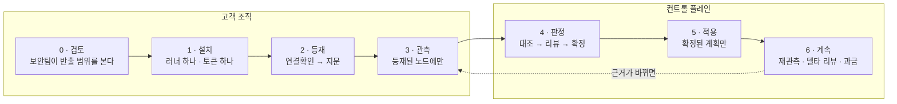
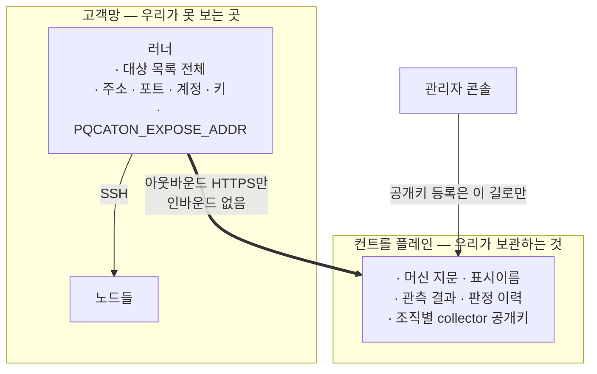
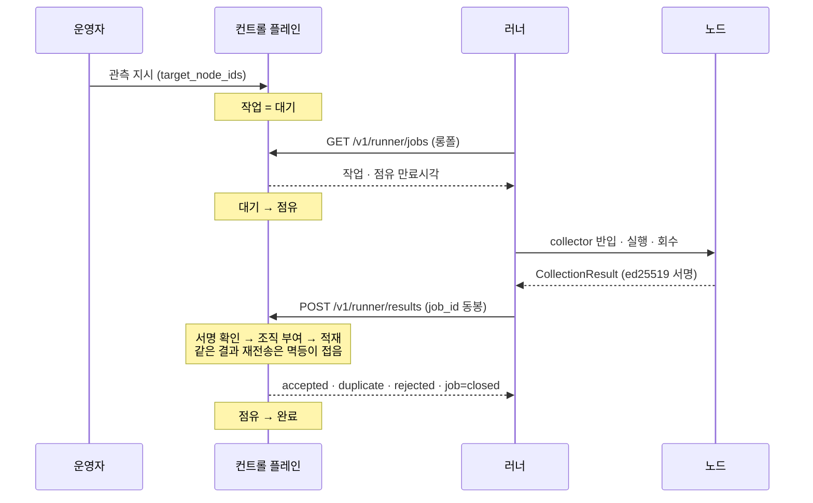
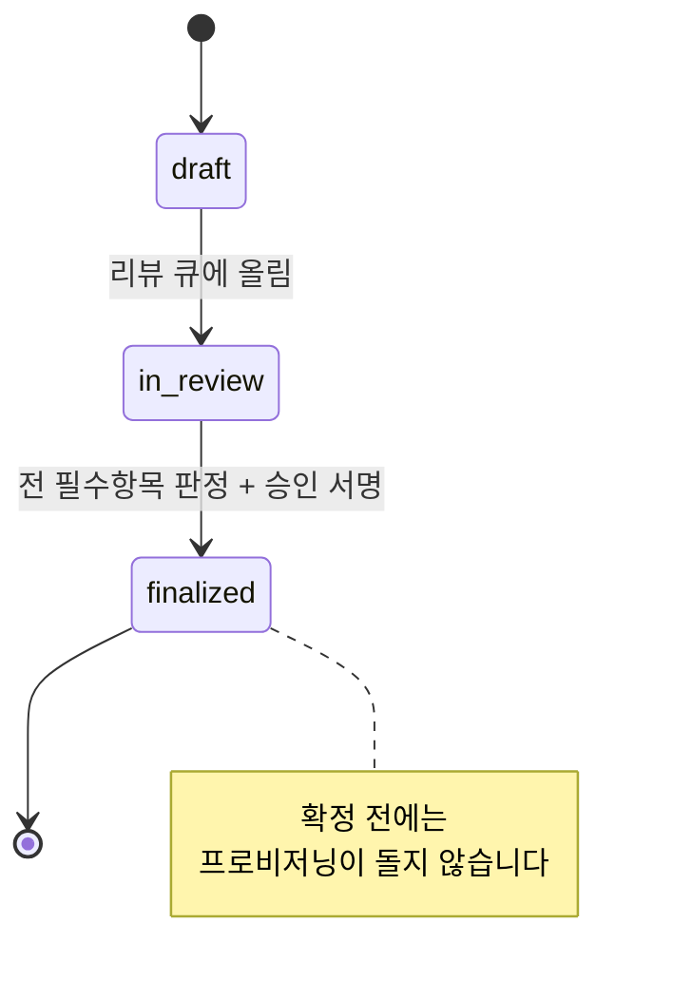

# 고객 여정 — 검토에서 확정·적용까지

설계는 여러 문서에 나뉘어 있습니다. [러너](../saas/design.md)는 고객망 안, [거버넌스](design.md)는
컨트롤 플레인, [라이선스](../LICENSING.md)는 또 다른 문서입니다. **고객이 실제로 겪는 순서로는
어디에도 없습니다.**

이 문서는 새 설계가 아닙니다 — **이미 정해진 것을 고객의 시간순으로 다시 세운 것**입니다.
각 단계에 근거 링크와 **지금 되는지 여부**를 함께 답니다. 정확히 알려면 "무엇을 하기로
했나"만큼 "그중 무엇이 아직 없나"가 필요하기 때문입니다.

> **표기** — <kbd>됨</kbd> 코드가 있고 테스트로 지켜집니다 · <kbd>일부</kbd> 경계는 섰고 나머지가 남았습니다 ·
> <kbd>설계뿐</kbd> 문서만 있습니다.

---

## 한 장 요약

**되돌아오는 화살표가 이 제품의 모양입니다.** 한 번 훑고 끝나는 감사가 아니라, 관측이
계속 들어오고 그때마다 **바뀐 것만** 다시 판단합니다([§1.5](design.md)).

---

## 0. 검토 — 보안팀이 먼저 보는 자리 <kbd>됨</kbd>

고객 서버에서 **고객의 권한으로** 도는 코드를 놓는 일입니다. 그래서 첫 관문은 영업이 아니라
보안 검토이고, [러너 설계 §4](../saas/design.md)가 그 자리를 위해 쓰였습니다.

| 밖으로 보냅니다 | 보내지 않습니다 |
|---|---|
| 관측 결과 — 어떤 노드가 어떤 암호 자산을 쓰는가 | **접속 정보 일체** — 주소·포트·계정·키·비밀번호 |
| 관측된 통신 엣지와 협상 결과 | **파일 원문** — 설정 파일을 읽어 보내지 않습니다 |
| 완전성 맵 — 무엇을 **관측하지 못했는가** | **패킷 페이로드** — 협상 그룹만 봅니다. 복호화하지 않습니다 |
| 러너 상태 — 버전·마지막 실행 | 애플리케이션 데이터 |

**무엇이 무엇으로 막히는지를 뭉뚱그리지 않습니다.** SSH 키·비밀번호는 **타입**이 막고(담을
필드가 없습니다), 파일 원문·패킷 페이로드는 **규약**이 막습니다(`raw_capture`는 자유형
`bytes`입니다). 규약은 타입보다 약한 약속이라 수신 API가 한 겹 더 봅니다. 이 차이를 그대로
말합니다 — 한 줄이 틀리면 문서 전체의 신뢰가 깎입니다.

**검토를 할 수 있는 이유는 소스가 공개돼 있기 때문입니다.** 러너가 무엇을 하는지 읽을 수
없으면 놓을 이유가 없습니다([LICENSING](../LICENSING.md)). 프로덕션 5노드까지는 무료라, 검토
다음 단계가 계약이 아니라 **시험 설치**입니다.

---

## 1. 설치 — 러너 하나, 토큰 하나 <kbd>일부</kbd>

고객이 준비하는 것을 최소로 둡니다. 어느 포장이든 하는 일은 같습니다([§3](../saas/design.md)).

| | 누구에게 | 무엇을 새로 두나 |
|---|---|---|
| **이미 돌리는 Ansible에 잡 하나** | AWX·Tower를 이미 운영하는 조직 | 없습니다. 절차는 이미 승인돼 있습니다 |
| **컨테이너 하나** | Ansible이 없는 조직 | 컨테이너 하나 |

### 무엇이 어디에 있는지가 이 단계에서 정해집니다

**연결은 한 방향입니다.** 러너가 묻고 컨트롤 플레인이 답합니다 — 고객 방화벽에 인바운드
예외가 필요 없습니다([§6.1](../saas/design.md)).

| 이 단계에서 고객이 정하는 것 | |
|---|---|
| **토큰** | 조직 단위로 발급받아 러너에 넣습니다. **조직은 토큰에서 유도됩니다** — 러너가 자기 조직을 주장할 수 없습니다 |
| **대상 목록** | 주소·계정·키를 러너 설정에 둡니다. 컨트롤 플레인에 올라오지 않습니다 |
| **주소 노출** | `PQCATON_EXPOSE_ADDR` 기본은 `off`입니다. 화면에서 IP로 노드를 보고 싶으면 `on`([§6.3.1](../saas/design.md)) |

**그 설정이 러너에 있다는 것이 핵심입니다.** 컨트롤 플레인에서 바꿀 수 없습니다 — 바꿀 수
있으면 그 약속은 우리가 언제든 깰 수 있는 것이 되고, 고객이 **검증할 대상**이 아니라 우리를
믿어 달라는 말이 됩니다.

**collector 공개키는 러너가 닿는 어떤 경로로도 등록되지 않습니다.** 러너를 잡은 쪽이 키쌍을
만들어 등록하고 그 키로 서명하면, 토큰 하나로 두 층이 다 열립니다. 등록은 관리자 콘솔
경로뿐입니다([§6.2](../saas/design.md)).

> <kbd>일부</kbd> 토큰 발급·검증과 공개키 등록소는 **됩니다**(M0). 러너 자신과 `register`
> 엔드포인트는 아직 없습니다(M5) — 지금은 러너를 토큰에 묶지 못해 `runner_id`가 자기
> 주장입니다.

---

## 2. 등재 — "연결확인" <kbd>설계뿐</kbd>

관측 전에 한 단계를 둡니다. **운영자가 대상을 올리고 「연결확인」을 누르면, 러너가 붙어
머신 지문을 확인해 옵니다.** 그 뒤의 관측은 **등재된 노드에만** 갑니다([§6.3](../saas/design.md)).

**등재는 컨트롤 플레인이 대상을 지목하는 것이 아닙니다.** 우리는 주소를 모르니 지목할 수가
없습니다 — 화면에서 하는 일은 "연결확인을 실행하라"는 지시 하나이고, 돌아오는 것은
**지문·표시이름·성패**입니다.

| 이 단계가 없으면 | |
|---|---|
| **접속 실패를 관측 뒤에 압니다** | 수백 대를 등록하면 방화벽·계정·권한으로 상당수가 안 붙습니다. 관측을 다 돌린 뒤에 알면 그 시간이 버려집니다 |
| **청구서에서 노드 수를 처음 봅니다** | 등재가 있으면 운영자가 청구 전에 "이번 달 몇 노드인지"를 압니다 |
| **회피가 안 드러납니다** | 접속 정보를 다른 서버로 돌리면 **다른 지문**이 올라옵니다. 관측까지 갈 것도 없이 새 노드로 세어집니다 |
| **무료 5노드를 집행할 자리가 없습니다** | 관측을 돌린 뒤에 거절하면 **이미 남의 서버를 들여다본 뒤**입니다 |

실패한 대상은 러너가 붙인 로컬 별칭으로 보고합니다 — *"web-01 — 인증 거부"*. 주소 없이도
운영자가 무엇이 안 붙었는지 압니다.

**지문이 겹치거나 어긋나면 등재를 보류하고 운영자에게 묻습니다.** VM을 클론하면 두 머신이
하나로 보이고, 재설치하면 같은 머신이 새 노드로 보입니다. 어느 쪽이든 기계가 정할 일이
아닙니다.

---

## 3. 관측 — 등재된 노드에만 <kbd>일부</kbd>

한 번의 왕복은 이렇게 돕니다. **작업을 닫는 것까지가 한 왕복입니다** —
[§6.2.1](../saas/design.md).

**러너가 죽으면** 점유가 만료되고 작업이 대기로 돌아갑니다. 읽기 작업은 두 번 해도 대상이
바뀌지 않고 결과는 멱등이 접습니다. **`provision`만 다릅니다**(5단계).

| 이 단계가 지키는 것 | |
|---|---|
| **서명 없는 결과는 받지 않습니다** | 여러 조직의 결과가 한 저장소로 모입니다. 조용히 통과하는 경로를 두지 않습니다 |
| **거절한 사실은 남깁니다** | 조용히 버리면 **러너가 잘못 설정된 것과 아무 일도 없던 것이 구분되지 않습니다** |
| **실패를 숨기지 않습니다** | 관측이 안 됐으면 안 됐다고 올립니다. 조용히 빠지면 중앙에서 "그 노드엔 없다"로 읽힙니다 |
| **본문이 너무 크면 자르지 않고 거절합니다** | 잘라서 받으면 관측 결과가 조용히 훼손되고, *"관측했는데 없더라"*가 됩니다 |

**등재되지 않은 통신 상대가 걸리면** 조용히 버리지 않고 **「등재 판정 요청」으로 띄웁니다.**
과금하지 않되 존재는 알립니다 — 조직이 모르던 연결이 이 제품의 첫 값이기 때문입니다.

> <kbd>일부</kbd> 결과 수신·검증·적재와 작업 배포는 **됩니다**(M1·M2). collector를 실제로
> 반입·실행·회수하는 러너 쪽(M4)이 남았습니다.

---

## 4. 판정 — 대조 · 리뷰 · 확정 <kbd>일부</kbd>

관측이 쌓이면 **선언(CMDB)과 대조**합니다. 여기서부터가 pqcota가 명시적으로 하지 않기로 한
자리이고, 이 리포가 맡는 부분입니다([§1](design.md)).

| 상태 | 무엇 | 누가 정하나 |
|---|---|---|
| **CONFIRMED** | 선언 ∩ 관측 | 자동 |
| **UNDECLARED** | 관측만 있음 — **shadow 통신** | 자동으로 **띄우고**, 판단은 사람 |
| **UNOBSERVED** | 선언만 있음 | **사람만** — 실재하는데 못 본 것인지, 이미 없어진 것인지 |

**UNDECLARED가 첫 값입니다.** CMDB에 없는데 실제로 통신하고 있는 엣지 — 조직이 모르는
연결입니다.

**UNOBSERVED를 기계가 확정하지 않는 이유**는 완전성 맵에 있습니다. "관측 안 됨"이 *원리상 못
봄(갭)*인지 *실제 없음*인지 갈리고, 갭이면 재수집이지 판정이 아닙니다.

리뷰 큐는 정답을 주지 않고 **판정 대상을 구조화**합니다 — 우선순위는 `위험도 × 블라스트반경
× 데이터민감도`입니다. 그리고 확정은 이 게이트를 지납니다:

**이 게이트가 이 제품에서 가장 강한 규칙입니다**([§1.4](design.md)). 링·도메인 단위 부분
확정은 허용하되, 확정되지 않은 것은 5단계로 넘어가지 않습니다.

**판정은 재수집에도 남습니다.** 엣지 상태가 아니라 "인간의 결론"이기 때문입니다. 근거 증거가
실질적으로 바뀌면 그 판정만 재검토 플래그를 답니다 — **전면 재리뷰가 아니라 델타
리뷰**입니다([§1.5](design.md)).

> <kbd>일부</kbd> 대조 엔진과 리뷰-확정 상태기계는 **됩니다**(`pkg/inventory`). 사람이 쓰는
> 화면이 없습니다(M6) — 지금은 CLI 텍스트입니다.

---

## 5. 적용 — 확정된 것만 <kbd>설계뿐</kbd>

`provision` 작업은 **확정된 계획에서만** 나옵니다. 컨트롤 플레인이 그 게이트를 지키므로
러너는 받은 것을 돌릴 뿐 판단하지 않습니다.

**만료되면 자동으로 다시 주지 않습니다.** 여기서만 규칙이 뒤집힙니다:

| 작업 | 점유가 만료되면 | 왜 |
|---|---|---|
| `enroll` · `observe` | **다시 대기로.** 자동 재배포 | 읽기입니다. 두 번 해도 대상이 안 바뀝니다 |
| **`provision`** | **「확인 필요」로.** 사람에게 넘깁니다 | **쓰기입니다.** 러너가 이미 적용했는데 응답만 못 준 것일 수 있습니다. 다시 주면 두 번 적용되고, 두 번째 `before` 캡처는 **이미 바뀐 상태**를 찍어 되돌릴 근거가 망가집니다 |

*"두 번 적용해도 괜찮게 만들면 되지 않나"* — 플레이북은 대개 멱등하게 쓰지만 우리가 그것을
**보장할 수는 없습니다.** 보장할 수 없는 것을 전제로 자동 재실행을 걸지 않습니다.

사람이 판단할 근거는 남아 있습니다 — 적용 전 상태 캡처와 실행 기록이 이미 저장되므로
*"어디까지 됐나"*를 보고 다시 돌릴지 정합니다.

---

## 6. 계속 도는 자리 <kbd>설계뿐</kbd>

도입이 끝나도 같은 고리가 계속 돕니다.

| | |
|---|---|
| **재관측 → 델타 리뷰** | 바뀐 근거에 걸린 판정만 다시 봅니다 |
| **제외분 재검토** | "이 자산은 안 본다"는 제외는 영구 면제가 아닙니다. 주기적으로 다시 훑어 *빼둔 사이 위험해진 것*을 리뷰 큐로 올립니다([§1.6](design.md)) |
| **월중 고유 노드 과금** | 등재가 세는 자리입니다. 등재 실패는 과금하지 않습니다 |
| **러너 살아있음·버전** | 조용히 일을 안 하는 러너가 *"관측할 것이 없다"*로 읽히면 안 됩니다 |

---

## 지금 어디까지 됐나

여정의 각 단계가 어느 마일스톤에 걸려 있는지입니다. 순서는 [implementation.md](../saas/implementation.md)가
정하고, 무엇으로 끝났다고 말하는지는 [testcases.md](../saas/testcases.md)가 정합니다.

| 여정 | 마일스톤 | 상태 |
|---|---|---|
| 1 · 설치 — 토큰·조직 경계, collector 공개키 등록소 | **M0** | 끝 |
| 3 · 관측 — 결과 수신·검증·적재 | **M1** | 끝 |
| 3 · 관측 — 작업 배포·점유·회수·닫기 | **M2** | 거의 끝. 종류별 점유 만료와 옛 러너 거르기가 남음 |
| 2 · 등재 — 지문·충돌 보류·노드 카운터 | **M3** | 없음 |
| 3 · 관측 — 러너의 collector 반입·실행·회수 | **M4** | 없음. **PoC 최소선이 여기까지** |
| 1 · 설치 — `register`·`status` | **M5** | 없음 |
| 4 · 판정 — 사람이 쓰는 화면 | **M6** | 없음 |

**4단계의 엔진(대조·리뷰-확정)은 마일스톤 밖에서 이미 됩니다** — `pkg/inventory`에 있고
호스팅을 모릅니다. 고객이 자기 서버에 설치해도 그대로 돕니다.

## 이 문서가 정하지 않는 것

| | 어디에 |
|---|---|
| 화면 설계 | 없습니다. M6에서 정합니다 |
| 가격표 | 라이선스가 정하는 것은 **무료 경계**(프로덕션 5노드)뿐입니다 |
| 컨트롤 플레인 인프라·운영 절차 | 별도 비공개 리포. 보안 제품의 인프라 지도는 공개 대상이 아닙니다([saas/README](../saas/README.md)) |
