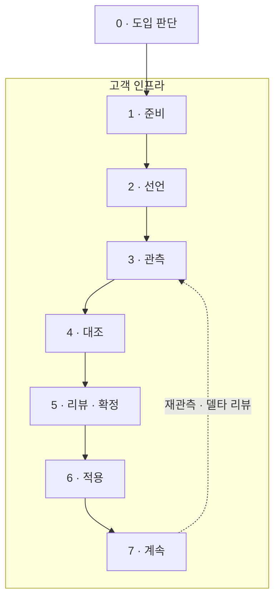
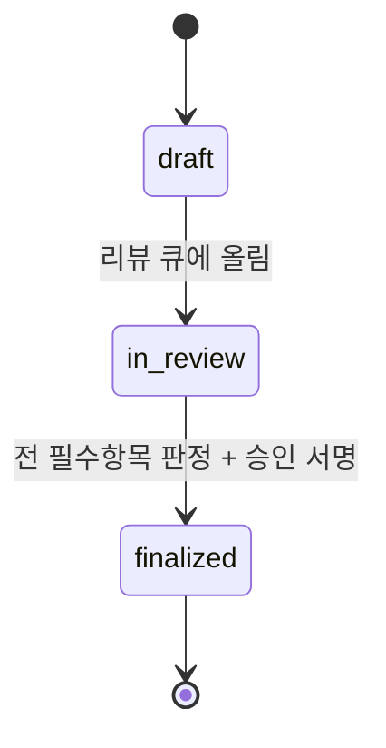

# 여정 — 자기 서버에 설치해 쓰는 경우

이 문서는 **직접 설치해 쓰는 길**을 처음부터 끝까지 따라갑니다. 호스팅으로 맡기는 길은 여기
없습니다 — 그쪽은 러너·토큰·등재가 더 붙고, 문서도 따로 있습니다([saas/README.md](../saas/README.md)).

**여기서 밖으로 나가는 것은 하나도 없습니다.** 관측도 대조도 판정도 전부 고객 인프라 안에서
끝납니다. 우리에게 보낼 것도, 우리가 받을 것도 없습니다.

> **§ 표기**: 별도 언급이 없으면 pqcota
> [규정서](https://github.com/randyinthedev-hash/pqcota/blob/main/docs/regulation.md)의 절 번호입니다.
> 구조 그림은 [architecture.html](architecture.html)에 있습니다.

---

## 한눈에



**전부 한 상자 안입니다.** 이 그림에 클라우드가 없다는 것이 이 길의 성질입니다.

---

## 0. 도입 판단

먼저 정할 것은 **어느 길로 갈지**입니다.

| | 직접 설치 (이 문서) | 호스팅 |
|---|---|---|
| 관측 결과가 있는 곳 | **고객 인프라 안에서 끝납니다** | 우리 컨트롤 플레인으로 올라옵니다 |
| 필요한 것 | 러너 없음 · 토큰 없음 · 등재 없음 | 러너 노드 한 대 · 영역마다 토큰 |
| 무료 범위 | **프로덕션 5노드까지, 기간 제한 없음**([LICENSE](../LICENSE)) | 5노드 · 1영역 · **30일** |
| 운영 부담 | 고객이 집니다 — 스케줄·저장소·업그레이드 | 우리가 집니다 |

**소스가 공개된 값이 여기 있습니다.** 호스팅을 안 쓰기로 해도, 안 쓰다가 그만두기로 해도
**5노드까지는 직접 설치해 계속 씁니다.** 그것이 [BUSL-1.1](../LICENSE)의 Additional Use Grant이고
기간 조건이 없습니다.

### 보안팀이 먼저 묻는 것

| 질문 | 답 |
|---|---|
| 무엇이 대상 노드에 남나 | **아무것도 남지 않습니다.** collector를 밀어 넣고 실행하고 결과를 가져온 뒤 지웁니다. 에이전트도 데몬도 없습니다 |
| 접속 정보는 어디에 | 인벤토리에 담을 자리가 **타입에 아예 없습니다**(`MachineEndpoint`). 실행에만 쓰고 영속하지 않습니다 |
| 파일 원문·패킷 페이로드는 | 보내지 않습니다. 핸드셰이크의 협상 그룹만 봅니다 — 복호화하지 않습니다 |
| 관측하지 못한 것은 | **못 봤다고 말합니다.** 완전성 맵이 그 자리입니다 — 조용히 빠지면 *"그 노드엔 없다"*로 읽힙니다 |

---

## 1. 준비

필요한 것은 셋입니다.

| | |
|---|---|
| **pqcota** | 관측 도구. [상류 리포](https://github.com/randyinthedev-hash/pqcota)를 체크아웃합니다 — 이 리포는 그 계약만 소비합니다 |
| **Go** | 두 리포를 빌드합니다. `make`가 라이선스 게이트 → 빌드 → 테스트를 돕니다 |
| **Ansible** | collector 반입·실행·회수를 pqcota의 참조 플레이북이 합니다. **자체 원격 실행 엔진을 두지 않습니다** |

Postgres는 **선택입니다.** 판정을 append-only로 영속하려면 필요하고(`decision.PgJudgmentStore`),
한 번 훑어보는 정도면 파일만으로도 됩니다.

> **이 리포만으로는 아무것도 못 합니다.** 관측이 없으면 대조할 것이 없기 때문입니다.
> 반대는 성립합니다 — **pqcota는 혼자서도 끝까지 됩니다.**

---

## 2. 선언 — CMDB가 「있다」고 말한 것

대조에는 두 레인이 필요합니다. 관측은 도구가 만들지만 **선언은 조직이 내놓아야 합니다.**

```
declaration.json     scope · nodes · assets · edges
```

- **`scope`** — 무엇까지 볼 것인가. 스코프 마스터가 이것을 집행합니다(§1.4) — 등재되지 않은 대상은
  관측해도 적재되지 않습니다.
- **`nodes`** — 노드↔IP. 관측된 IP를 노드로 되돌리는 자리입니다(§0.4).
- **`assets`·`edges`** — 있다고 선언한 자산과 통신.

**선언이 비어 있어도 돕니다.** 그러면 전부 UNDECLARED로 나옵니다 — *"우리가 아는 게 하나도
없었다"* 는 사실 자체가 첫 리포트가 됩니다.

> **선언의 품질이 결과의 품질입니다.** CMDB가 낡았으면 UNOBSERVED가 부풀고, 그 대부분은
> *실재하지 않는 것*이 아니라 *선언이 낡은 것*입니다. 그 구분은 사람이 합니다(5단계).

---

## 3. 관측

pqcota의 참조 플레이북이 대상 노드에 collector를 반입·실행·회수합니다.

```bash
ansible-playbook -i inventory.ini discovery/ansible/discover.yml
```

| 무엇을 보나 | |
|---|---|
| **openssl** | 어떤 암호 라이브러리·알고리즘이 실제로 쓰이는가 |
| **jvm** | JCA provider 구성 |
| **network** | 핸드셰이크에서 **협상된 키교환 그룹** — 여기서 양자내성 등급이 나옵니다 |

산출은 `results/*.json`(`CollectionResult`)입니다. **관측하지 못한 것도 함께 나옵니다** —
완전성 맵이 「원리상 못 봄」과 「실제 없음」을 갈라 둡니다.

---

## 4. 대조 — 3-상태

관측과 선언을 맞대는 자리가 **이 리포**입니다.

```bash
pqcota-report <results-dir> <declaration.json> [topology.dot]
```

| 상태 | 정의 | 등급 | 뜻 |
|---|---|---|---|
| **CONFIRMED** | 선언 ∩ 관측 | AUTO | 신뢰도 최상 |
| **UNDECLARED** | 관측만 | AUTO | **shadow** — 조직이 모르는 통신. **이 도구의 첫 값입니다** |
| **UNOBSERVED** | 선언만 | **MANUAL** | 실재하는데 못 본 것인지, 이미 없어진 것인지 — **기계가 확정하지 않습니다** |

confidence는 관측 빈도·기간·선언 신선도·소스 일치도·`evidence_strength`로 정해집니다(§3.5).
`inferred-low`는 상한을 누릅니다 — **약한 근거가 높은 확신으로 올라가지 못하게** 하는 자리입니다.

산출은 둘입니다: **3-상태 뷰**와 **거버넌스 토폴로지**(DOT). 토폴로지는 색으로 양자내성
posture를, 선으로 대조 상태를 나타냅니다 — 정직성 규정을 그래프 문법으로 강제합니다(§12.2).

---

## 5. 리뷰 · 확정

**대조 엔진은 정답을 주지 않습니다.** 판정 대상을 구조화해 사람에게 넘깁니다(§3.1).

| 리뷰 큐 | |
|---|---|
| **자동통과 후보** | CONFIRMED + 고신뢰 + 저위험 → 일괄 승인 묶음. **승인은 사람이 합니다** |
| **필수 개별 리뷰** | UNDECLARED(최우선) · 저신뢰 UNOBSERVED · 레거시 터치 · 컷오버가 상대를 깨는 엣지 |
| 우선순위 | 위험도 × 블라스트반경 × 데이터민감도 |



**리뷰 단위는 정책이 기본입니다**(§3.4). 버전×링크모드, JDK×provider 같은 정책 템플릿이 리뷰
대상이고 동종 자산은 일괄로 갑니다. 개별 격리는 예외 — 정책 예외·고위험·shadow 엣지만
엣지 단위로 봅니다. **수천 대를 한 건씩 보는 리뷰는 끝나지 않습니다.**

판정은 **엣지 상태가 아니라 사람의 결론**이라, 재수집으로 관측이 바뀌어도 대상에 붙어 남습니다.
`BasisHash`가 근거를 추적하고, **근거가 실질적으로 바뀌면 그 판정만** 재검토 플래그를 답니다.

---

## 6. 적용

```
finalized ──▶ 확정 계획 ──▶ pqcota-provision
```

**finalized 전에는 적용이 돌지 않습니다.** 이것이 이 제품에서 가장 센 게이트입니다(§3.7).
링·도메인 단위 부분 확정은 허용합니다 — 전부 확정될 때까지 아무것도 못 하면 큰 조직에서
영영 시작하지 못합니다.

적용 전 상태 캡처와 실행 기록은 pqcota가 남깁니다(`pqcota_provisioning_record`). 되돌릴 근거가
거기 있습니다.

> **적용은 두 번 돌리면 안 되는 유일한 단계입니다.** 관측과 대조는 몇 번을 돌려도 대상이
> 바뀌지 않지만, 적용은 씁니다 — 두 번째 `before` 캡처는 **이미 바뀐 상태**를 찍어 되돌릴
> 근거가 망가집니다.

---

## 7. 계속

도입이 끝나도 같은 고리가 돕니다.

| | |
|---|---|
| **재관측 → 델타 리뷰** | 근거가 바뀐 판정만 다시 봅니다. **전면 재리뷰가 아닙니다** |
| **stale 판정 만료** | 오래된 판정은 신뢰도가 감쇠하고 주기적으로 재확인합니다 |
| **제외분 재검토** | "이 자산은 안 본다"는 제외는 영구 면제가 아닙니다. 주기적으로 다시 훑어 **빼둔 사이 위험해진 것**을 리뷰 큐로 올립니다(§1.6) |
| **판단 이력** | 누가·언제·무엇을 근거로 정했는지가 append-only로 남습니다 — 사고 뒤에 답해야 하는 것이 이것입니다 |

---

## 지금 어디까지 됐나

| 여정 | 어디에 | 상태 |
|---|---|---|
| 3 · 관측 | pqcota | **끝** — 이 리포 밖입니다 |
| 4 · 대조 — 3-상태·confidence·리뷰 큐·토폴로지 | [`pkg/inventory/reconcile`](../pkg/inventory/reconcile) | **끝** |
| 5 · 리뷰-확정 상태기계·판정 영속 | [`pkg/inventory/decision`](../pkg/inventory/decision) | **끝** |
| 4·5 실행 도구 | [`inventory/cmd`](../inventory/cmd) | **끝** — `pqcota-reconcile` · `pqcota-report` |
| 6 · 적용 | pqcota `provisioning` | **끝** — 이 리포 밖입니다 |
| 2 · 선언 — 스코프 거버넌스(리뷰·감사·정책 상속) | §1.6 | **설계뿐** |
| 5 · 사람이 쓰는 화면 | — | **없습니다.** 지금은 CLI와 리포트입니다 |

**엔진은 됩니다.** [데모](../demo/README.md)가 pqcota의 디스커버리 데모 위에 그대로 얹혀
3-상태 대조와 거버넌스 토폴로지를 냅니다.

---

## 이 문서가 정하지 않는 것

| | 어디에 |
|---|---|
| 화면 설계 | 없습니다 |
| 관측의 내부 | pqcota의 [디스커버리 설계](https://github.com/randyinthedev-hash/pqcota/tree/main/discovery) |
| 호스팅으로 쓸 때의 여정 | 이 리포에 없습니다 — [saas/README.md](../saas/README.md) |
| 무엇을 어떤 순서로 바꿀지 | **이 도구가 정하지 않습니다.** 판정 대상을 구조화할 뿐, 확정은 사람이 합니다 |
